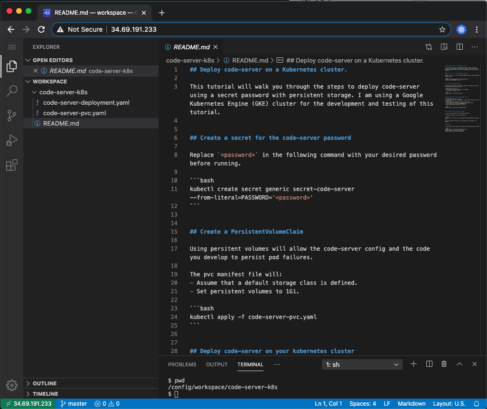

## Deploy code-server on a Kubernetes cluster.

This tutorial will walk you through the steps to deploy [code-server](https://github.com/cdr/code-server) using a secret password with persistent storage. I am using a Google Kubernetes Engine (GKE) cluster for the development and testing of this tutorial.


## Create a secret for the code-server password

Replace `<password>` in the following command with your desired password before running.

```bash
kubectl create secret generic secret-code-server --from-literal=PASSWORD='<password>'
```


## Create a PersistentVolumeClaim

Using persitent volumes will allow the code-server config and the code you develop to persist pod failures.

The pvc manifest file will:
- Assume that a default storage class is defined.
- Set persistent volumes to 1Gi.

```bash
kubectl apply -f code-server-pvc.yaml
```


## Deploy code-server on your kubernetes cluster

The deployment manifest file will:
- Create a service with a loadbalancer ip and expose code-server on port 80 using HTTP.
- Deploy code-server pinned to version 'v3.4.0-ls46'
- Set a password as defined by the kubernetes secret named "secret-code-server" using the PASSWORD value.
- Mount the persistent volume to `/config`.

```bash
kubectl apply -f code-server-deployment.yaml
```


## Access code-server using your browser

You can now access code-server using the service ip.

To get the IP address to access code-server.

```bash
kubectl get svc code-server -o=jsonpath={.status.loadBalancer.ingress[].ip}
```
Note: It may take a minute for the ip address to be assigned so be patient.



## Clean-up

If you would like to clean-up the resources created during this tutorial.

```bash
kubectl delete -f code-server-deployment.yaml
kubectl delete -f code-server-pvc.yaml
kubectl delete secret secret-code-server
```
